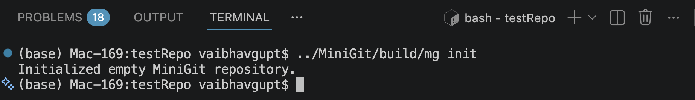
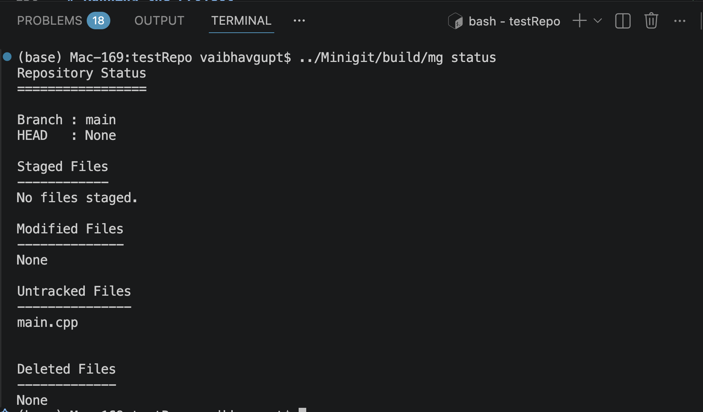
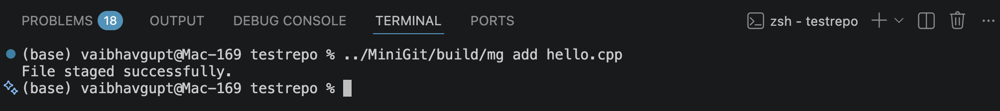
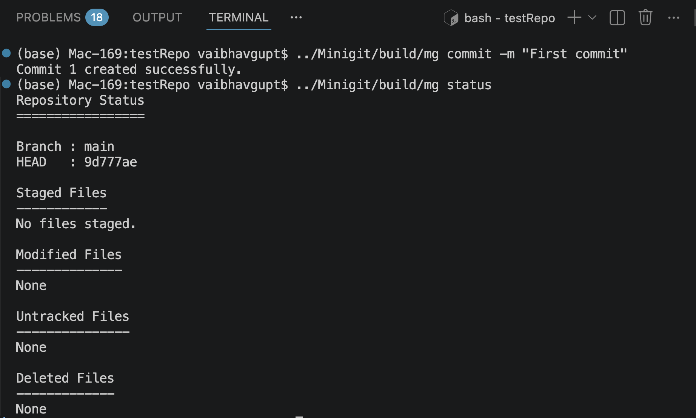
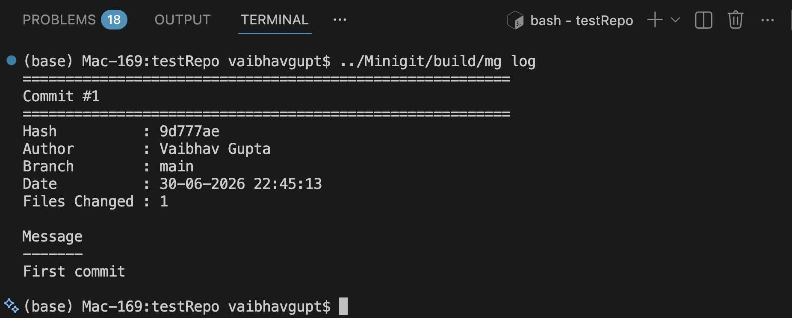

# Version Control System in C++

A Git-inspired Version Control System implemented from scratch in C++17 to understand the internal working of modern version control systems. The project recreates several core Git functionalities including repository initialization, file staging, snapshot-based commits, version restoration, commit history visualization, and repository state management.

The project follows a modular Object-Oriented Design and utilizes the C++ Standard Library along with `std::filesystem` for recursive directory traversal and repository management.

---

# Features

- Initialize a new repository (`init`)
- Stage files for tracking (`add`)
- Create snapshot-based commits (`commit`)
- Display repository status (`status`)
- View commit history (`log`)
- Visualize commit graph (`graph`)
- Compare file differences (`diff`)
- Restore previous versions (`checkout`)
- Reset repository state (`reset`)
- Support custom ignore rules using `.mgignore`
- Recursive repository traversal
- Snapshot recovery and rollback

---

# Tech Stack

- C++17
- C++ STL
- std::filesystem
- CMake
- Object-Oriented Programming (OOP)

---

# Project Structure

```
MiniGit
│
├── include/            # Header files
├── src/                # Source files
├── CMakeLists.txt      # CMake build configuration
├── .gitignore
└── README.md
```

---

# Prerequisites

Before building the project, make sure the following are installed.

### 1. C++17 Compiler

GCC 10+ or Clang 12+

Verify installation

```bash
g++ --version
```

or

```bash
clang++ --version
```

---

### 2. CMake

Check version

```bash
cmake --version
```

Install if needed

#### Ubuntu

```bash
sudo apt install cmake
```

#### macOS (Homebrew)

```bash
brew install cmake
```

---

### 3. Git

```bash
git --version
```

---

# Clone Repository

```bash
git clone https://github.com/Vaibhav-3720/Version-Control-System.git
cd Version-Control-System
```

---

# Build Instructions

Create a build directory

```bash
mkdir build
cd build
```

Generate build files

```bash
cmake ..
```

Compile

```bash
make
```

---

# Running the Project

Run the executable

```bash
../
```

The CLI will start, allowing you to execute supported version-control commands.

Create a directory to test the version control system:

```bash
mkdir TestRepo
cd TestRepo
```

Run the executable from the build directory:

```bash
../MiniGit/build/mg
```

or

```bash
../MiniGit/build/mg init
```

## depending on whether your application is interactive.

# Supported Commands

| Command   | Description               |
| --------- | ------------------------- |
| init      | Initialize repository     |
| add       | Stage files               |
| commit    | Create snapshot           |
| status    | Display repository status |
| log       | Show commit history       |
| graph     | Visualize commit graph    |
| diff      | Compare file changes      |
| checkout  | Restore previous snapshot |
| reset     | Reset repository          |
| .mgignore | Ignore selected files     |

---

# Design Overview

The project is organized into multiple modules following the **Single Responsibility Principle**.

Main components include:

- Repository Management
- File Tracking
- Commit Engine
- Index Management
- Status Tracking
- Diff Engine
- Commit Graph
- Checkout & Recovery
- Ignore Rules
- Command-Line Interface

---

## Screenshots

### Repository Initialization



### Repository Status



### Repository AddFiles



### Repository commit



### Repository log



```
screenshots/
    init.png
    add.png
    status.png
    commit.png
    log.png
```

---

# Future Improvements

- Branch support
- Merge operations
- Remote repositories
- Conflict detection
- Binary object storage
- SHA-256 object storage
- Garbage collection

---

# What I Learned

Through this project I gained practical experience with

- Object-Oriented Software Design
- Modular C++ Development
- File System APIs
- Snapshot-based Versioning
- Commit Hashing
- Recursive Directory Traversal
- Command-Line Interface Design

---

